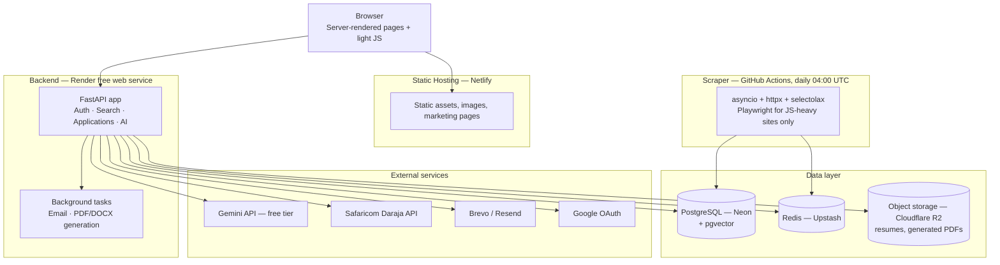
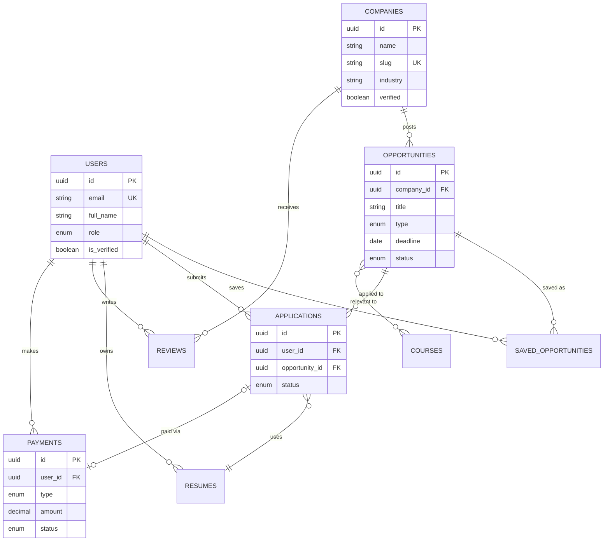
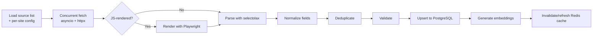

# Attachify — Software Requirements Specification & Technical Design

**Version 0.2 — Core decisions confirmed**
**Prepared for:** Elvis Midega
**Status:** §22 decisions locked in and folded into the plan below. No implementation code has been written yet — confirm you're ready for Phase 0 and I'll start.

> Attachify launches as its own project — separate repo, separate domain from your **Nairobi ICT Attachment & Internship Directory** — but it doesn't start from nothing. The ICT directory proved the concept (a curated list, a Python freshness-checker, GitHub + Netlify deployment), and its company list becomes one seed source among several in Phase 1's multi-sector launch. Section 21 (Roadmap) has the detail.

## Table of Contents
1. [Executive Summary](#1-executive-summary)
2. [Scope, Guiding Principles & Phasing Philosophy](#2-scope-guiding-principles--phasing-philosophy)
3. [Personas](#3-personas)
4. [Functional Requirements](#4-functional-requirements)
5. [Non-Functional Requirements](#5-non-functional-requirements)
6. [System Architecture](#6-system-architecture)
7. [Technology Decisions](#7-technology-decisions)
8. [Database Design](#8-database-design)
9. [API Design](#9-api-design)
10. [Scraper Architecture](#10-scraper-architecture)
11. [AI / RAG Architecture](#11-ai--rag-architecture)
12. [UI/UX Design System](#12-uiux-design-system)
13. [SEO Strategy](#13-seo-strategy)
14. [Security Checklist](#14-security-checklist)
15. [Accessibility Checklist](#15-accessibility-checklist)
16. [Payments: M-Pesa Daraja Integration](#16-payments-m-pesa-daraja-integration)
17. [Email Delivery Strategy](#17-email-delivery-strategy)
18. [Legal & Compliance Considerations](#18-legal--compliance-considerations)
19. [Folder Structure](#19-folder-structure)
20. [Hosting & Deployment Plan](#20-hosting--deployment-plan)
21. [Development Roadmap & Phases](#21-development-roadmap--phases)
22. [Open Questions — Need Your Input](#22-open-questions--need-your-input)
23. [Suggested Additional Features](#23-suggested-additional-features)
24. [Key External References](#24-key-external-references)

---

## 1. Executive Summary

Attachify is a nationwide platform helping Kenyan students discover verified attachment, internship, graduate-trainee, and apprenticeship opportunities, across every accredited course and every sector — not just ICT. It layers AI (a grounded chatbot, resume builder, cover letter generator, CV analysis), community (reviews, saved jobs, alerts), and M-Pesa-powered transactions on top of a fast, continuously-refreshed opportunity directory built by an automated scraper.

The brief as written is the scope of a funded startup with a small team — full national data coverage, an AI toolkit, a payments-and-agency layer, and a review community, all built and hosted for KSh 0. That's achievable, but not all at once and not without a few real-world dependencies (a registered business for M-Pesa, for instance). This document treats the full brief as the **target state** and lays out a **phased path** to it, so you're always shipping something usable rather than waiting for everything to be ready at once.

Every technology recommendation below was checked against currently-published free-tier terms rather than assumed — free tiers in this space change often (Gemini's quotas dropped 50-80% in December 2025 alone), so treat the specific numbers as "true as of this research" and re-verify at implementation time.

## 2. Scope, Guiding Principles & Phasing Philosophy

**Guiding principles**

- **Free-first, always.** Every choice below is free at the scale Attachify will run at for at least its first year. Where a free tier has a real limitation (expiry, pause-on-inactivity, rate limit), it's called out explicitly rather than glossed over.
- **Multi-sector, curated — not exhaustive.** Confirmed: Phase 1 launches across sectors from day one (ICT, banking, telecoms, healthcare, NGOs, manufacturing, hospitality, and more), not ICT-only. What's still phased is *depth within that breadth* — a curated, verified list per sector beats an exhaustive-but-stale one; growing toward national completeness in each sector is Phase 5's job, not a Phase 1 promise.
- **Ship the directory before the agency.** Search, listings, and company pages are the product. AI, community, and payments are amplifiers you layer on once the core has real users and real data.
- **You approve every architectural fork.** Where this document makes a call for you (framework, hosting provider, schema shape), it's because you asked for that explicitly. Where the call is really a business or legal decision, it's held out separately in [Section 22](#22-open-questions--need-your-input).

**Phasing philosophy** (detailed in [Section 21](#21-development-roadmap--phases)): Foundation → Core Directory (MVP) → AI Toolkit → Community & Engagement → Monetization (gated on legal review) → Hardening & national scale-out.

## 3. Personas

| Persona | Need | Primary flows |
|---|---|---|
| **Diploma/degree student** | Find a verified attachment matching my course, county, and timeline before my deadline | Search, filters, save, alerts, apply |
| **Final-year student, job-ready** | Build a strong application fast | Resume builder, cover letter generator, CV analysis |
| **Company HR/attachment coordinator** | Be found by qualified students; manage reputation | Company page, review responses (future) |
| **Elvis (admin)** | Keep listings accurate, moderate reviews, watch platform health | Admin dashboard, moderation queue, analytics |

## 4. Functional Requirements

Requirements are grouped by module and tagged with the phase they target (see [Section 21](#21-development-roadmap--phases)).

| Module | Key requirements | Phase |
|---|---|---|
| **Auth** | Email/password signup+login, Google OAuth, JWT access+refresh tokens, forgot/reset password, delete account, remember me, password visibility toggle, confirm-password live match, zxcvbn-style strength meter, email syntax + MX validation | 0 |
| **Search & Discovery** | Filter by course, level (certificate/diploma/degree), county, town, industry, company, keyword, paid/unpaid, remote/hybrid, deadline, opportunity type; full-text search; pagination; sort by relevance/deadline/newest | 1 |
| **Opportunities** | Detail page with requirements, responsibilities, location, deadline, source link; "similar opportunities"; save/unsave | 1 |
| **Companies** | Company profile, verified badge, past + current opportunities, hiring trend chart, industry, location | 1 |
| **Scraper** | Daily automated run, dedupe, normalize, validate, expire stale listings, refresh cache and homepage stats | 1 |
| **SEO/Content** | Semantic HTML, JobPosting/Organization structured data, sitemap, robots.txt, OG/Twitter cards, institution & course landing pages | 1 |
| **Saved opportunities** | Bookmark/unbookmark, "saved" dashboard tab | 1 |
| **Resume Builder** | Multi-section form (personal, education, skills, projects, experience, references, achievements, certifications, languages), 4 templates (Modern, Professional, ATS-Friendly, Student), PDF + DOCX export | 2 |
| **Cover Letter Generator** | Pulls the target opportunity's stated requirements and tailors tone/keywords to them | 2 |
| **CV Analysis** | Upload CV → grammar, formatting, ATS-compatibility, missing-skills, wording, match score, suggestions | 2 |
| **AI Career Assistant** | RAG chatbot grounded only in the Attachify DB; career/interview/resume/application guidance; explicit "I don't have verified data on that" fallback | 2 |
| **Reviews & Community** | Rate + review a company, read reviews, report fake opportunities/reviews, moderation queue | 3 |
| **Email Alerts** | Subscribe by course/county/industry/keyword/company; digest or instant | 3 |
| **Analytics** | Live counters: companies tracked, opportunities by type, today's updates, opportunities this week, visitors, registered users, applications submitted | 3 |
| **Donations** | M-Pesa STK Push for KSh 100/250/500/1000/custom, thank-you screen | 4 |
| **Applications** | Upload documents, pay KSh 50 via STK Push, Attachify submits on the student's behalf, confirmation screen + email | 4 (gated — see [§18](#18-legal--compliance-considerations)) |
| **Legal pages** | Privacy Policy, Terms of Service, Cookie Policy | 0–1, content firmed up before Phase 4 |
| **Contact** | "Contact the Developer" card — phone opens WhatsApp with a pre-filled message, email link | 0 |

## 5. Non-Functional Requirements

| Category | Target |
|---|---|
| **Performance** | Search API p95 < 300ms server-side; Largest Contentful Paint < 2.5s on 3G-fast mobile; homepage stats served from cache, never computed on request |
| **Availability** | Best-effort on free tiers; document the cold-start mitigation in [§20](#20-hosting--deployment-plan) rather than promise five-nines |
| **Scalability** | Stateless API layer (horizontally scalable if you ever add a second instance); cache-aside pattern for hot reads; DB indexes on every filterable column |
| **Security** | See [§14](#14-security-checklist) |
| **Accessibility** | WCAG 2.1 AA — see [§15](#15-accessibility-checklist) |
| **SEO** | Lighthouse SEO ≥ 95, Performance ≥ 90 on key pages — see [§13](#13-seo-strategy) |
| **Browser support** | Last 2 versions of Chrome, Firefox, Safari, Edge; graceful degradation without JS for read-only pages |
| **Responsiveness** | Fluid layout from 320px to 4K; test breakpoints at 375 / 768 / 1024 / 1440 / 1920px |

## 6. System Architecture

Everything free, split across a handful of specialist providers because no single free tier covers the whole stack — the trade-off is more accounts to manage in exchange for a genuinely production-capable, genuinely free result.



**Why server-rendered pages, not a vanilla-JS SPA:** the brief asks for excellent SEO, working Open Graph/Twitter cards, and no unnecessary frameworks. A client-rendered SPA fights all three — link-preview crawlers for WhatsApp/Facebook/Twitter largely don't execute JavaScript, so a share of an opportunity page would show a blank preview. FastAPI + Jinja2 templates render real HTML for every public page (home, search, opportunity, company, resources), with vanilla JS layered on for interactivity. For the dynamic bits — filters updating results, infinite scroll, modals — **HTMX** (~14KB, not a framework) lets the server keep owning the HTML while the page still feels reactive, which keeps you inside "avoid unnecessary frontend frameworks" while not hand-rolling fetch/DOM-diffing logic for every interaction. The authenticated dashboard (resume builder, saved jobs, chat) can lean on plain JS + fetch, since SEO doesn't apply there.

## 7. Technology Decisions

| Concern | Choice | Why | Free-tier caveat to watch |
|---|---|---|---|
| Backend framework | FastAPI (async), Pydantic v2, SQLAlchemy 2.0 async, Alembic | Matches your brief; typed, self-documenting (auto OpenAPI/Swagger); your C#/TypeScript background transfers directly to Pydantic's type-hint style | — |
| Frontend rendering | Jinja2 SSR + HTMX + vanilla JS | SEO/OG correctness; minimal JS footprint | — |
| Database | **Neon** (serverless Postgres) | Permanent free tier (not a trial), 100 CU-hrs/month, scale-to-zero, pgvector supported, ~500ms-2s cold start (vs. 10-15s on some competitors) | 0.5GB storage/project on free tier — fine for launch, plan the upgrade path as data grows |
| Cache | **Upstash Redis** | Permanent free tier, HTTP + TCP access, works from serverless and traditional hosts alike | 500,000 commands/month, 256MB — monitor as traffic grows |
| Object storage | **Cloudflare R2** | 10GB free, zero egress fees (the free tier that actually matters at scale, since most competitors meter bandwidth) | 1M writes / 10M reads per month |
| Backend hosting | **Render** free web service | Simplest FastAPI deploy path of the free options | Sleeps after ~15 min idle → 30-60s cold start on the next request; at least one recent report suggests Render may be tightening/discontinuing this tier for some accounts, so confirm availability when you sign up, and have Fly.io or PythonAnywhere as a fallback in mind |
| Scraper scheduling | **GitHub Actions** `schedule` trigger | Genuinely free (unlimited on public repos, ~2,000 min/month on private), no server to babysit | All times are UTC only; auto-disables after 60 days with no repo activity (mitigate with a monitoring step, not just a commit-and-forget); avoid scheduling exactly on the hour — GitHub's busiest minute — use an off-peak time like `17 4 * * *` |
| AI chatbot | **Gemini API** free tier (Flash / Flash-Lite) | Genuinely free, no card, 1M-token context | Quotas are volatile (cut 50-80% in Dec 2025 alone) and currently tight — roughly 15 RPM / ~1,000-1,500 RPD on the lightest free model as of mid-2026; **free-tier prompts may be used to improve Google's models** — don't send raw CVs/PII through it without disclosure (see [§18](#18-legal--compliance-considerations)) |
| Embeddings for RAG | Local `sentence-transformers` model (e.g. `all-MiniLM-L6-v2`) run at scrape/ingest time, stored in **pgvector** | Free, unlimited, no rate limit on the bulk-indexing workload; only the final chat completion touches Gemini's rate-limited quota | CPU-only inference is fine at this corpus size (thousands, not millions, of listings) |
| Full-text search | Postgres `tsvector` + `pg_trgm` | Free, already in your DB, more than sufficient at national-directory scale; avoids standing up and hosting a separate search engine | Revisit (e.g. Meilisearch) only if relevance becomes a real bottleneck |
| Auth | JWT (access + refresh) + Google OAuth, `argon2` password hashing | Industry standard, free | — |
| Email | **Brevo** (or Resend) transactional email | Real free daily/monthly sending allowance, works from any backend host | Needs SPF/DKIM domain verification for deliverability regardless of provider |
| Payments | **Safaricom Daraja API** (STK Push), direct | Avoids the extra per-transaction fee that aggregators (Paystack, IntaSend) charge on top of M-Pesa's own charges | Production access needs a registered business + Till/Paybill — see [§16](#16-payments-m-pesa-daraja-integration) |
| Frontend hosting | **Netlify** | You already have this working for the ICT directory — reuse it | — |
| Version control / CI | GitHub + GitHub Actions | Free, and doubles as the scraper's scheduler | — |

## 8. Database Design



Full DDL (representative core schema — extend as needed, this is meant to be a working starting point, not exhaustive):

```sql
CREATE EXTENSION IF NOT EXISTS "uuid-ossp";
CREATE EXTENSION IF NOT EXISTS vector;
CREATE EXTENSION IF NOT EXISTS pg_trgm;

CREATE TYPE user_role AS ENUM ('student', 'moderator', 'admin');
CREATE TYPE course_level AS ENUM ('certificate', 'diploma', 'degree', 'postgraduate');
CREATE TYPE opportunity_type AS ENUM ('attachment', 'internship', 'graduate_program', 'apprenticeship');
CREATE TYPE opportunity_status AS ENUM ('active', 'expired', 'filled', 'flagged');
CREATE TYPE application_status AS ENUM ('pending_payment', 'submitted', 'failed', 'cancelled');
CREATE TYPE payment_type AS ENUM ('application_fee', 'donation');
CREATE TYPE payment_status AS ENUM ('pending', 'completed', 'failed');

CREATE TABLE courses (
    id UUID PRIMARY KEY DEFAULT uuid_generate_v4(),
    name VARCHAR(200) NOT NULL,
    level course_level NOT NULL,
    field_of_study VARCHAR(150) NOT NULL,
    created_at TIMESTAMPTZ NOT NULL DEFAULT now()
);

CREATE TABLE companies (
    id UUID PRIMARY KEY DEFAULT uuid_generate_v4(),
    name VARCHAR(255) NOT NULL,
    slug VARCHAR(255) UNIQUE NOT NULL,
    industry VARCHAR(120) NOT NULL,
    county VARCHAR(100),
    town VARCHAR(100),
    website VARCHAR(255),
    logo_url VARCHAR(255),
    description TEXT,
    verified BOOLEAN NOT NULL DEFAULT FALSE,
    created_at TIMESTAMPTZ NOT NULL DEFAULT now(),
    updated_at TIMESTAMPTZ NOT NULL DEFAULT now()
);
CREATE INDEX idx_companies_industry ON companies(industry);
CREATE INDEX idx_companies_county ON companies(county);

CREATE TABLE users (
    id UUID PRIMARY KEY DEFAULT uuid_generate_v4(),
    email VARCHAR(255) UNIQUE NOT NULL,
    password_hash VARCHAR(255),
    google_id VARCHAR(255) UNIQUE,
    full_name VARCHAR(255) NOT NULL,
    phone VARCHAR(20),
    role user_role NOT NULL DEFAULT 'student',
    course_id UUID REFERENCES courses(id) ON DELETE SET NULL,
    county VARCHAR(100),
    is_verified BOOLEAN NOT NULL DEFAULT FALSE,
    is_active BOOLEAN NOT NULL DEFAULT TRUE,
    created_at TIMESTAMPTZ NOT NULL DEFAULT now(),
    updated_at TIMESTAMPTZ NOT NULL DEFAULT now(),
    CONSTRAINT chk_auth_method CHECK (password_hash IS NOT NULL OR google_id IS NOT NULL)
);

CREATE TABLE opportunities (
    id UUID PRIMARY KEY DEFAULT uuid_generate_v4(),
    company_id UUID NOT NULL REFERENCES companies(id) ON DELETE CASCADE,
    title VARCHAR(255) NOT NULL,
    type opportunity_type NOT NULL,
    description TEXT NOT NULL,
    requirements TEXT,
    responsibilities TEXT,
    county VARCHAR(100),
    town VARCHAR(100),
    is_remote BOOLEAN NOT NULL DEFAULT FALSE,
    is_hybrid BOOLEAN NOT NULL DEFAULT FALSE,
    is_paid BOOLEAN NOT NULL DEFAULT FALSE,
    stipend_amount NUMERIC(10, 2),
    application_deadline DATE,
    external_url VARCHAR(500),
    source_url VARCHAR(500) NOT NULL,
    status opportunity_status NOT NULL DEFAULT 'active',
    search_vector tsvector,
    scraped_at TIMESTAMPTZ,
    created_at TIMESTAMPTZ NOT NULL DEFAULT now(),
    updated_at TIMESTAMPTZ NOT NULL DEFAULT now()
);
CREATE INDEX idx_opportunities_company ON opportunities(company_id);
CREATE INDEX idx_opportunities_type ON opportunities(type);
CREATE INDEX idx_opportunities_status ON opportunities(status);
CREATE INDEX idx_opportunities_county ON opportunities(county);
CREATE INDEX idx_opportunities_deadline ON opportunities(application_deadline);
CREATE INDEX idx_opportunities_search ON opportunities USING GIN(search_vector);

CREATE FUNCTION opportunities_search_vector_update() RETURNS trigger AS $$
BEGIN
    NEW.search_vector :=
        setweight(to_tsvector('english', coalesce(NEW.title, '')), 'A') ||
        setweight(to_tsvector('english', coalesce(NEW.description, '')), 'B') ||
        setweight(to_tsvector('english', coalesce(NEW.requirements, '')), 'C');
    RETURN NEW;
END;
$$ LANGUAGE plpgsql;

CREATE TRIGGER trg_opportunities_search_vector
    BEFORE INSERT OR UPDATE ON opportunities
    FOR EACH ROW EXECUTE FUNCTION opportunities_search_vector_update();

CREATE TABLE opportunity_courses (
    opportunity_id UUID NOT NULL REFERENCES opportunities(id) ON DELETE CASCADE,
    course_id UUID NOT NULL REFERENCES courses(id) ON DELETE CASCADE,
    PRIMARY KEY (opportunity_id, course_id)
);

CREATE TABLE saved_opportunities (
    id UUID PRIMARY KEY DEFAULT uuid_generate_v4(),
    user_id UUID NOT NULL REFERENCES users(id) ON DELETE CASCADE,
    opportunity_id UUID NOT NULL REFERENCES opportunities(id) ON DELETE CASCADE,
    created_at TIMESTAMPTZ NOT NULL DEFAULT now(),
    UNIQUE (user_id, opportunity_id)
);

CREATE TABLE resumes (
    id UUID PRIMARY KEY DEFAULT uuid_generate_v4(),
    user_id UUID NOT NULL REFERENCES users(id) ON DELETE CASCADE,
    template VARCHAR(50) NOT NULL DEFAULT 'modern',
    content JSONB NOT NULL,
    pdf_url VARCHAR(500),
    docx_url VARCHAR(500),
    created_at TIMESTAMPTZ NOT NULL DEFAULT now(),
    updated_at TIMESTAMPTZ NOT NULL DEFAULT now()
);

CREATE TABLE cover_letters (
    id UUID PRIMARY KEY DEFAULT uuid_generate_v4(),
    user_id UUID NOT NULL REFERENCES users(id) ON DELETE CASCADE,
    opportunity_id UUID REFERENCES opportunities(id) ON DELETE SET NULL,
    content TEXT NOT NULL,
    created_at TIMESTAMPTZ NOT NULL DEFAULT now()
);

CREATE TABLE payments (
    id UUID PRIMARY KEY DEFAULT uuid_generate_v4(),
    user_id UUID NOT NULL REFERENCES users(id) ON DELETE CASCADE,
    type payment_type NOT NULL,
    amount NUMERIC(10, 2) NOT NULL,
    phone_number VARCHAR(20) NOT NULL,
    checkout_request_id VARCHAR(100) UNIQUE,
    mpesa_receipt VARCHAR(50),
    status payment_status NOT NULL DEFAULT 'pending',
    created_at TIMESTAMPTZ NOT NULL DEFAULT now(),
    updated_at TIMESTAMPTZ NOT NULL DEFAULT now()
);

CREATE TABLE applications (
    id UUID PRIMARY KEY DEFAULT uuid_generate_v4(),
    user_id UUID NOT NULL REFERENCES users(id) ON DELETE CASCADE,
    opportunity_id UUID NOT NULL REFERENCES opportunities(id) ON DELETE CASCADE,
    resume_id UUID NOT NULL REFERENCES resumes(id),
    cover_letter_id UUID REFERENCES cover_letters(id),
    payment_id UUID REFERENCES payments(id),
    status application_status NOT NULL DEFAULT 'pending_payment',
    submitted_at TIMESTAMPTZ,
    created_at TIMESTAMPTZ NOT NULL DEFAULT now(),
    UNIQUE (user_id, opportunity_id)
);

CREATE TABLE reviews (
    id UUID PRIMARY KEY DEFAULT uuid_generate_v4(),
    user_id UUID NOT NULL REFERENCES users(id) ON DELETE CASCADE,
    company_id UUID NOT NULL REFERENCES companies(id) ON DELETE CASCADE,
    rating SMALLINT NOT NULL CHECK (rating BETWEEN 1 AND 5),
    title VARCHAR(200),
    body TEXT NOT NULL,
    is_flagged BOOLEAN NOT NULL DEFAULT FALSE,
    created_at TIMESTAMPTZ NOT NULL DEFAULT now(),
    UNIQUE (user_id, company_id)
);

CREATE TABLE alert_subscriptions (
    id UUID PRIMARY KEY DEFAULT uuid_generate_v4(),
    user_id UUID NOT NULL REFERENCES users(id) ON DELETE CASCADE,
    course_id UUID REFERENCES courses(id) ON DELETE CASCADE,
    county VARCHAR(100),
    industry VARCHAR(120),
    keyword VARCHAR(150),
    company_id UUID REFERENCES companies(id) ON DELETE CASCADE,
    created_at TIMESTAMPTZ NOT NULL DEFAULT now()
);

CREATE TABLE chat_sessions (
    id UUID PRIMARY KEY DEFAULT uuid_generate_v4(),
    user_id UUID NOT NULL REFERENCES users(id) ON DELETE CASCADE,
    created_at TIMESTAMPTZ NOT NULL DEFAULT now()
);

CREATE TABLE chat_messages (
    id UUID PRIMARY KEY DEFAULT uuid_generate_v4(),
    session_id UUID NOT NULL REFERENCES chat_sessions(id) ON DELETE CASCADE,
    role VARCHAR(20) NOT NULL,
    content TEXT NOT NULL,
    created_at TIMESTAMPTZ NOT NULL DEFAULT now()
);

CREATE TABLE opportunity_embeddings (
    opportunity_id UUID PRIMARY KEY REFERENCES opportunities(id) ON DELETE CASCADE,
    embedding vector(384) NOT NULL,
    updated_at TIMESTAMPTZ NOT NULL DEFAULT now()
);
CREATE INDEX idx_opportunity_embeddings_vector ON opportunity_embeddings USING ivfflat (embedding vector_cosine_ops);
```

## 9. API Design

REST, versioned under `/api/v1`, JSON in and out, FastAPI's auto-generated OpenAPI docs serve as the living reference once built.

| Resource | Endpoints |
|---|---|
| Auth | `POST /auth/register` · `POST /auth/login` · `POST /auth/google` · `POST /auth/refresh` · `POST /auth/forgot-password` · `POST /auth/reset-password` · `DELETE /auth/account` |
| Opportunities | `GET /opportunities` (search/filter/paginate) · `GET /opportunities/{id}` · `GET /opportunities/{id}/similar` |
| Companies | `GET /companies` · `GET /companies/{slug}` |
| Courses | `GET /courses` |
| Saved | `POST /saved-opportunities/{id}` · `DELETE /saved-opportunities/{id}` |
| Resumes | `POST /resumes` · `GET /resumes/{id}` · `PATCH /resumes/{id}` · `POST /resumes/{id}/export?format=pdf\|docx` |
| Cover letters | `POST /cover-letters` |
| CV analysis | `POST /cv-analysis` |
| AI chat | `POST /chat/message` · `GET /chat/history` |
| Applications | `POST /applications` · `GET /applications/{id}` · `POST /applications/{id}/pay` |
| Payments | `POST /payments/stk-push` · `POST /payments/mpesa/callback` (webhook, Safaricom → us) |
| Reviews | `POST /companies/{id}/reviews` · `GET /companies/{id}/reviews` · `POST /reviews/{id}/report` |
| Alerts | `POST /alert-subscriptions` · `GET /alert-subscriptions` · `DELETE /alert-subscriptions/{id}` |
| Stats | `GET /stats/live` |

**Example — search:**
```
GET /api/v1/opportunities?course=diploma-it&county=nairobi&type=internship&paid=true&page=1&sort=deadline

200 OK
{
  "results": [
    {
      "id": "b2f1...",
      "title": "Software Engineering Intern",
      "company": { "name": "Safaricom", "slug": "safaricom", "verified": true },
      "type": "internship",
      "county": "Nairobi",
      "is_paid": true,
      "deadline": "2026-09-15"
    }
  ],
  "page": 1,
  "per_page": 20,
  "total": 143
}
```

**Example — STK Push:**
```
POST /api/v1/payments/stk-push
{ "type": "application_fee", "application_id": "9c1e...", "phone_number": "2547XXXXXXXX" }

202 Accepted
{ "checkout_request_id": "ws_CO_...", "status": "pending", "message": "Enter your M-Pesa PIN on your phone to complete." }
```
The client polls `GET /payments/{id}` (backed by the `ResultURL` callback Safaricom posts to `/payments/mpesa/callback`) rather than blocking on the STK request itself, since STK Push is asynchronous by design.

## 10. Scraper Architecture



- **Source config, not hardcoded scrapers per site:** each source is a small config (base URL, list-page selector or API, detail-page selectors, `needs_js: bool`) so adding a new organization is a config entry, not new code, wherever the site's HTML is regular enough for that.
- **Change detection first:** before parsing, compare a hash of the fetched page against the last-seen hash (stored per source_url) — skip parsing entirely on no-op. This is a direct evolution of the dead-link checker you already built for the ICT directory; the same "did this actually change" logic just gets a hash check and a parse step bolted on.
- **Respect `robots.txt` and rate-limit per host** — concurrency is per-source-domain, not global, so one slow host doesn't starve the others and no single site gets hammered.
- **Scheduling:** GitHub Actions `schedule: - cron: "17 4 * * *"` (04:17 UTC = 07:17 EAT — a few minutes off the hour to avoid GitHub's busiest scheduling window, close enough to "7am" for the brief's intent). Add a `workflow_dispatch:` trigger too, so you can run it manually while testing. Because GitHub disables schedules after 60 days of total repo inactivity, add a lightweight scheduled "heartbeat" step that fails loudly (e.g., posts to a free UptimeRobot or a Slack/Discord webhook) if the scrape run itself doesn't complete — GitHub does not notify you of scheduler failures on its own.
- **Playwright only where required**, flagged per-source — it's the heaviest dependency in the stack and free compute is exactly where you don't want to reach for it by default.

## 11. AI / RAG Architecture

1. **Ingest time (free, unlimited):** every opportunity's title + description + requirements is embedded locally with `sentence-transformers` (`all-MiniLM-L6-v2`, 384-dim, CPU) and stored in `opportunity_embeddings` via pgvector. This runs as a scraper pipeline step, not an API call, so it never touches Gemini's rate limit.
2. **Query time:** user message → embed with the same local model → pgvector cosine-similarity top-k → construct a grounded prompt containing only retrieved, verified listings/resources → Gemini Flash-Lite generates the reply.
3. **Grounding discipline:** the system prompt instructs the model to answer only from the retrieved context and to say plainly that it doesn't have verified data when nothing relevant is retrieved — never to invent a listing. This is a system-prompt-level and retrieval-level constraint, not something to rely on the model to self-police.
4. **Rate-limit handling:** because the current free Gemini tier is genuinely tight (roughly 15 requests/minute on the lightest free model), cache common Q&A pairs in Redis (e.g., "how do I write a cover letter" doesn't need a fresh call every time), queue+backoff on 429s, and show a plain "the assistant is busy, try again shortly" state rather than a raw error.
5. **Privacy:** don't pass raw CV content or personally identifying details into the free-tier prompt without disclosure — Google's free tier may use those inputs to improve its models. Strip/redact PII before sending where feasible, and say so in the Privacy Policy.

## 12. UI/UX Design System

**Revision note:** the first pass used a flat, thick-border, hard-shadow treatment matching your portfolio's established look. On seeing it built, that direction didn't fit this product; too heavy, and the multi-hue palette read as dull rather than premium. This section now reflects the revised direction: a single tonal navy-to-blue family, soft rounded forms, and diffused shadows for depth, based on a reference palette you supplied.

**Color tokens:**

| Token | Hex | Use |
|---|---|---|
| Navy 950 | `#000521` | Page background |
| Navy 900 | `#020C47` | Card and panel surfaces |
| Navy 700 | `#011F65` | Elevated surfaces, gradient endpoints |
| Blue 600 | `#0E4EB2` | Secondary accent |
| Blue 500 | `#2078CF` | Primary accent: buttons, links, stat numbers |
| Blue 300 | `#6FA8E8` | Lighter tint for links and badge text on dark surfaces |
| Text primary | `#F3F7FD` | Headings and primary text |
| Text secondary | `#A9BEDE` | Body copy, meta labels |

Two additions (Blue 300 and the text colors) beyond the five supplied hex codes, needed for working contrast on a dark background; everything else traces directly to the reference palette.

Depth comes from soft, blurred shadows (`box-shadow: 0 20px 48px rgba(2,12,71,0.55)`) and generous corner radii (12 to 20px, fully rounded for buttons and badges), not borders or hard offsets. A restrained gradient is used in two places only, the hero background and card surfaces, rather than throughout the page; most of the UI stays on flat solid navy for a calmer, less try-hard feel.

**Type system:**
- **Display (headings):** Sora, 600/700 weight. Clean and geometric, reads as modern fintech/tech rather than decorative.
- **Body:** Inter. Legible workhorse for descriptions and long text.

Both are free (Google Fonts).

**Signature element:** a small rounded pill badge (`.badge`) in a translucent blue fill, used for "Verified" and "Paid" states. Understated rather than decorative, consistent with the calmer overall direction.

**Icons:** a single consistent SVG set (Lucide or Phosphor), no emoji anywhere, per the original brief.

**Motion:** minimal and purposeful; buttons lift slightly on hover with a soft shadow bloom, cards lift on hover in results grids, `prefers-reduced-motion` respected throughout.

**Hero concept:** headline and tagline on one side, a small stack of real featured opportunity cards on the other, set against a subtle radial gradient from Navy 700 into Navy 950. Shows real listings rather than decorative graphics.

**Page notes** (brief; full wireframes are a later, separate pass):

| Page | Note |
|---|---|
| Home | Hero (above), "How it works" as a genuine numbered 3-step sequence (search, apply, verified), live stats strip |
| Search | Filter sidebar, result cards, HTMX-powered live filtering without full reload |
| Company detail | Header with verified badge, tabs for open/past opportunities, hiring trend chart, reviews |
| Resume Builder | Stepper form, live preview pane, template switcher |
| AI Assistant | Chat UI with visible "grounded in verified listings" indicator and source chips under any listing it references |
| Dashboard | Saved, applications, alerts, account tabs |
| 404 | On-brand, not a generic error page; points back to search |

## 13. SEO Strategy

- **Semantic HTML5** landmarks throughout (`header`, `nav`, `main`, `article`, `footer`).
- **JobPosting structured data (Schema.org) on every opportunity page.** This is the single highest-leverage SEO move available here: Google surfaces JobPosting-marked-up pages in its dedicated "Google for Jobs" rich results, a distribution channel built almost exactly for this content type, for free.
- `Organization` schema site-wide; `BreadcrumbList`; `AggregateRating`/`Review` schema on company pages once reviews exist.
- Open Graph + Twitter Card meta tags generated per page (dynamic for opportunities/companies, since these are the pages most likely to be shared on WhatsApp).
- **Dynamic XML sitemap** (index split across opportunities/companies/static pages), regenerated after each scrape — a static sitemap would go stale immediately given how often listings change.
- `robots.txt` disallowing `/dashboard`, `/admin`; allowing everything public.
- Canonical URLs on every filtered/paginated search results view, to avoid duplicate-content dilution from query parameters.
- Institution- and course-specific landing pages (e.g. "Attachment opportunities for Kenyatta University students," "Diploma in IT internships in Nairobi") — cheap to generate from data you already have, and captures long-tail search traffic students actually type.
- Lazy-loaded, WebP-first images (generated server-side at ingest, e.g. via Pillow) with proper `alt` text everywhere.

## 14. Security Checklist

- Argon2 (or bcrypt) password hashing; JWT access tokens short-lived, refresh tokens rotated and revocable.
- Pydantic schema validation on every input; parameterized queries throughout (SQLAlchemy handles this by default — never hand-build SQL strings).
- CSRF protection on state-changing form submissions from server-rendered pages; SameSite cookies.
- Rate limiting (Redis-backed) on auth endpoints, search, and the AI chat endpoint especially, since that one has a real external cost ceiling.
- CSP headers restricting script/style sources; output-encode all user-generated content (reviews, opportunity descriptions from scraped HTML) to prevent stored XSS.
- Secrets only in environment variables, never in frontend code or committed to the repo — this applies doubly to the Daraja consumer secret and passkey.
- Role-based authorization (student / moderator / admin) enforced server-side on every protected route, not just hidden in the UI.
- M-Pesa callback endpoint validates the request is genuinely from Safaricom's IP range before trusting a payment confirmation.

## 15. Accessibility Checklist

- Target **WCAG 2.1 AA**: 4.5:1 contrast for body text, 3:1 for large text/UI components (the flat, high-contrast palette in §12 clears this comfortably in both modes).
- Full keyboard navigation for search filters, modals, and the resume builder stepper; visible focus rings (not suppressed for aesthetics).
- Every form input has a real `<label>`; every icon-only control has an `aria-label`.
- `alt` text on every image; decorative SVGs marked `aria-hidden`.
- Skip-to-content link on every page.
- `prefers-reduced-motion` respected (see §12).
- Test with Lighthouse, axe DevTools, and WAVE (all free) before each phase ships, not just once at the end.

## 16. Payments: M-Pesa Daraja Integration

**Sandbox is free and open today** — you can build and fully test STK Push, callbacks, and the whole applications-payment flow in sandbox without any business registration. **Production access is a separate, real-world process**, confirmed against Safaricom's current go-live requirements:

1. A registered business — a **sole proprietorship via eCitizen is sufficient**, it doesn't need to be a full company.
2. A business KRA PIN.
3. A registered M-Pesa **Till (Buy Goods) or Paybill number**, obtained separately from Daraja itself via Safaricom's business self-onboarding portal — Daraja doesn't issue one for you. Till numbers can be requested online and are typically faster; Paybill approval commonly takes 5-10 working days.
4. A live, publicly reachable **HTTPS callback URL** for `ResultURL`/`ConfirmationURL` (your Render deployment, once up).
5. A signed go-live request submitted through the Daraja portal, reviewed by Safaricom.

Realistically that's 1-3+ weeks of lead time, and it's the one piece of this whole plan that genuinely can't be done for free in the "no cost at all" sense — it's a real business-registration step, separate from the (free) software. Since you're planning to pursue this, start the registration as early as Phase 1-2 rather than waiting for Phase 4 to begin — it runs on Safaricom's timeline, not yours, so getting it moving in parallel with earlier development means it's ready when the payment code needs it instead of blocking launch. (A third-party aggregator like IntaSend or Paystack Kenya can shortcut the registration wait, at the cost of an extra per-transaction fee on top of M-Pesa's own charges — worth knowing about as a fallback, but direct Daraja stays truer to "free.")

## 17. Email Delivery Strategy

For the "confirmation email should appear to come from the user's own email account" requirement:

- **What's actually possible:** with Gmail Sign-In requesting the `gmail.send` scope, the app can send genuinely from the user's own Gmail account (it lands in their own Sent folder, "From" is really them). This is the closest thing to what's asked for, and it's free — but `gmail.send` is a Google-classified **sensitive scope**, so the app needs to go through Google's OAuth consent screen verification (privacy policy, in-use demo, review turnaround measured in days) before it can be used beyond a handful of test users. It's not available on day one of Phase 4.
- **The practical default until that's approved:** send from Attachify's own verified domain (via Brevo/Resend, with SPF/DKIM set up so it doesn't land in spam), set `Reply-To` to the user's email, and say clearly in the email body that it's a confirmation sent *on behalf of* the applicant. This is what the brief's own fallback instruction anticipates, and it's simple, secure, and free.

## 18. Legal & Compliance Considerations

These aren't reasons not to build the platform — they're real steps that belong on the roadmap next to the code, so Phase 4 doesn't stall on paperwork you didn't know you needed.

- **Kenya Data Protection Act, 2019 / ODPC registration.** As a small solo operation (annual revenue under ~KES 5 million *and* fewer than 10 employees), you likely qualify for the small-entity exemption from mandatory registration at launch — but a handful of "always register regardless of size" categories exist for certain higher-risk processing activities, and Attachify does handle CVs, phone numbers, and payment data, so it's worth a quick check against the current ODPC guidance (or a short consult) once you're past the earliest MVP stage. If registration does apply, it's a straightforward KES 4,000 process (KES 2,000 to renew every 2 years) — not a large barrier, just one to plan for rather than discover.
- **"Submit the application on the student's behalf, for a fee."** This is the one feature in the brief that reads more like a licensed employment-placement service than a job board, depending on how it's structured and marketed — Kenya regulates private employment agencies that place people for a fee. Confirmed approach: Phase 4 launches with the **free** "auto-fill your documents into the company's own application channel, one click to send" flow first; the *paid*, Attachify-submits-it-for-you version waits until you've had a chance to check it against current employment-agency rules (or run it past a lawyer — this is genuinely outside what I can verify with confidence). The Terms of Service should also be explicit that Attachify verifies listings to the best of its ability but doesn't guarantee outcomes.
- **Reviews/ratings.** Real risk of defamation claims from companies over negative reviews. Keep the "report fake opportunity/review" flow (already in the brief) as a real moderation queue, not just a button, and require reviews to state specific, factual experiences rather than open-ended commentary.
- **Data retention.** Uploaded CVs may contain ID numbers and other sensitive fields — define and publish a retention/deletion policy, and make sure "Delete Account" (already in the brief) actually purges stored documents from R2, not just the DB row.

## 19. Folder Structure

```
attachify/
├── backend/
│   ├── app/
│   │   ├── api/v1/routes/          # auth, opportunities, companies, applications, chat, payments...
│   │   ├── core/                   # config, security, dependencies
│   │   ├── models/                 # SQLAlchemy models
│   │   ├── schemas/                # Pydantic request/response schemas
│   │   ├── services/               # business logic (one file per module)
│   │   ├── repositories/           # DB access layer
│   │   ├── ai/                     # embeddings, retrieval, chat orchestration
│   │   ├── integrations/           # daraja/, gemini/, email/, google_oauth/
│   │   └── main.py
│   ├── alembic/                    # migrations
│   ├── tests/
│   └── requirements.txt
├── scraper/
│   ├── sources/                    # one config/module per source
│   ├── pipeline/                   # fetch, parse, normalize, dedupe, validate, embed
│   ├── run.py
│   └── requirements.txt
├── frontend/
│   ├── templates/                  # Jinja2 pages, partials
│   ├── static/
│   │   ├── css/
│   │   ├── js/
│   │   └── images/
├── docs/                           # this document lives here
├── .github/workflows/              # scraper.yml (cron), ci.yml
└── README.md
```

## 20. Hosting & Deployment Plan

| Layer | Provider | Notes |
|---|---|---|
| Static/marketing assets | Netlify | Already set up from the ICT directory |
| Backend API | Render (free web service) | Mitigate cold starts with an off-peak GitHub Actions "warm-up" ping during expected daytime traffic hours; re-verify free-tier terms at signup (see §7 caveat) |
| Database | Neon | Free, permanent, pgvector-ready |
| Cache | Upstash | Free, permanent |
| Object storage | Cloudflare R2 | Free, permanent, zero egress |
| Scraper | GitHub Actions | Free scheduled compute, no server to maintain |
| AI | Gemini API | Free tier, rate-limited |
| Payments | Safaricom Daraja | Free sandbox; production needs business registration (§16) |
| Email | Brevo or Resend | Free transactional tier |
| DNS/domain | Whatever registrar — confirmed purchase before launch; the one deliberate paid line item in this plan, most useful live before Phase 1's SEO work (canonical URLs, OG tags) rather than at the very end |

## 21. Development Roadmap & Phases

| Phase | Focus | Rough solo-dev duration | Key dependencies |
|---|---|---|---|
| **0 — Foundation** | Repo, CI, DB schema + migrations, auth skeleton, deploy pipeline live end-to-end | 2-3 weeks | GitHub, Neon, Render, Netlify accounts, domain purchased |
| **1 — Core Directory (MVP)** | Scraper live across multiple sectors from day one (ICT, banking, telecoms, healthcare, NGOs, manufacturing, hospitality and more — your existing ICT directory list folds in as one source among several), search/filter/pagination, company + opportunity pages, saved jobs, SEO fundamentals including institution/course landing pages and the verification-methodology page | 7-10 weeks (broader source curation across sectors takes longer than one sector would) | GitHub Actions cron, Upstash |
| **2 — AI Toolkit** | Resume builder + PDF/DOCX export, cover letter generator, CV analysis, RAG chatbot | 5-7 weeks | Gemini API, pgvector |
| **3 — Community & Engagement** | Reviews, email alerts, analytics dashboard, career resources content, application-readiness indicator (builds on Phase 2's CV analysis), public read-only opportunities API/RSS feed | 3-4 weeks | Brevo/Resend |
| **4 — Monetization (confirmed, phased)** | Donations first (lower legal complexity), then the paid application-submission flow once the employment-agency check in §18 clears — free auto-fill ships regardless | 3-4 weeks | Daraja production access, business registration (start this in Phase 1-2, see §16) |
| **5 — Hardening & National Scale-out** | Grow each sector toward fuller national coverage, accessibility/security audit (OWASP ZAP is free), performance tuning, broader SEO content | Ongoing | — |

This assumes solo, part-time-realistic pacing; treat the numbers as planning inputs, not commitments.

## 22. Decisions Locked In

Resolved on review — kept here as the record of what was decided, rather than left as open questions:

1. **Separate project.** Attachify launches as its own repo and domain, not a rebrand of `nairobi-ict-directory`. Phase 1 starts fresh; the ICT directory's company list is ported in as one seed source among several, not the whole foundation.
2. **Paid submission feature stays gated.** The free auto-fill flow ships first in Phase 4; the paid submit-on-your-behalf flow waits for the employment-agency check in §18.
3. **Multi-sector from day one.** Phase 1's scope and duration estimate in §21 now reflect a curated, multi-sector seed list rather than an ICT-first rollout.
4. **M-Pesa production access:** you'll pursue the registered business + Till/Paybill. §16 now recommends starting that process in parallel with Phase 1-2, not waiting for Phase 4.
5. **Domain:** confirmed as the one deliberate paid line item in the plan (§20); everything else in the stack stays free-tier.

No open items remain from the original draft.

## 23. Suggested Additional Features

Reviewed and folded into the roadmap where approved:

- **✅ Verification methodology page** — approved, now in Phase 1 (§21).
- **✅ Institution-specific and course-specific landing pages** — approved, now in Phase 1 alongside SEO fundamentals (§13, §21).
- **✅ Public, read-only opportunities API/RSS feed** — approved, now in Phase 3 (§21).
- **✅ Application-readiness indicator** — approved, now in Phase 3, building on Phase 2's CV analysis (§21).
- **❌ WhatsApp alerts** — declined, off the roadmap. Revisit only if there's ever revenue to justify Meta's WhatsApp Business API costs beyond its free conversation threshold.

## 24. Key External References

Free-tier terms move fast in this space — verify current numbers at these sources before committing:

- Neon: https://neon.tech
- Upstash: https://upstash.com
- Cloudflare R2: https://developers.cloudflare.com/r2/
- Render: https://render.com
- Google AI Studio / Gemini API: https://ai.google.dev
- GitHub Actions billing: https://docs.github.com/en/actions/concepts/billing-and-usage
- Safaricom Daraja: https://developer.safaricom.co.ke
- M-Pesa for Business self-onboarding: https://m-pesaforbusiness.co.ke
- Office of the Data Protection Commissioner, Kenya: https://www.odpc.go.ke

---

*End of draft. Nothing past this point has been built — reply with any changes to Section 22's open questions (or anything else you'd like reworked), and implementation starts from your go-ahead.*
